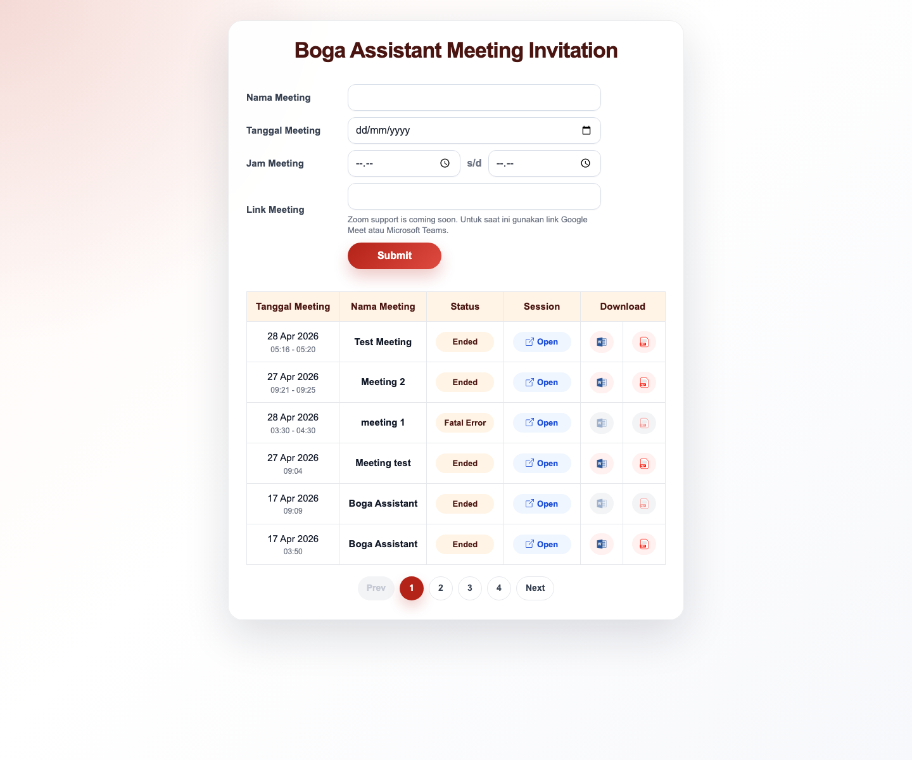
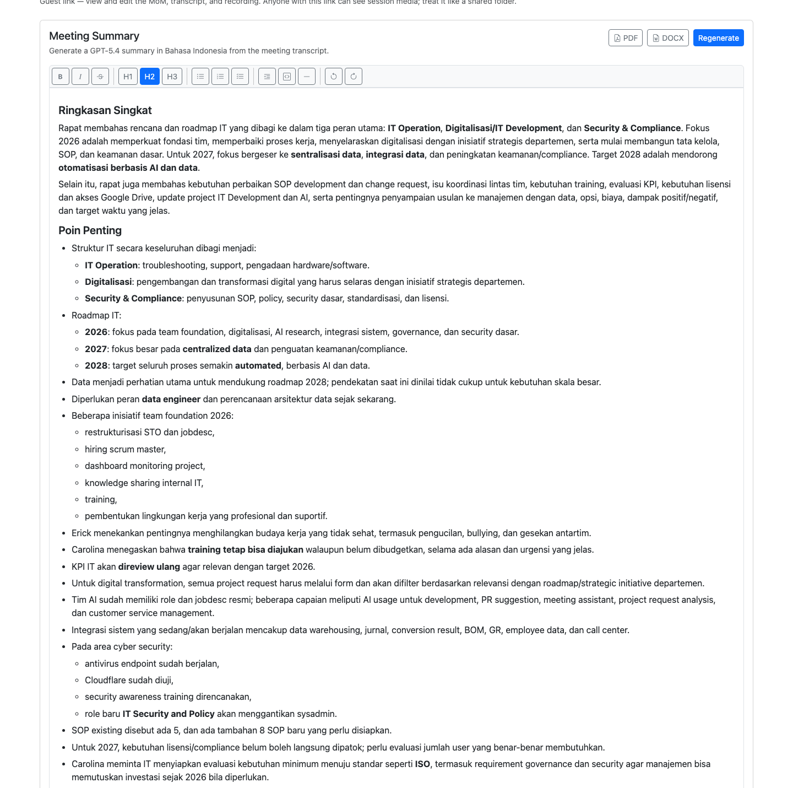
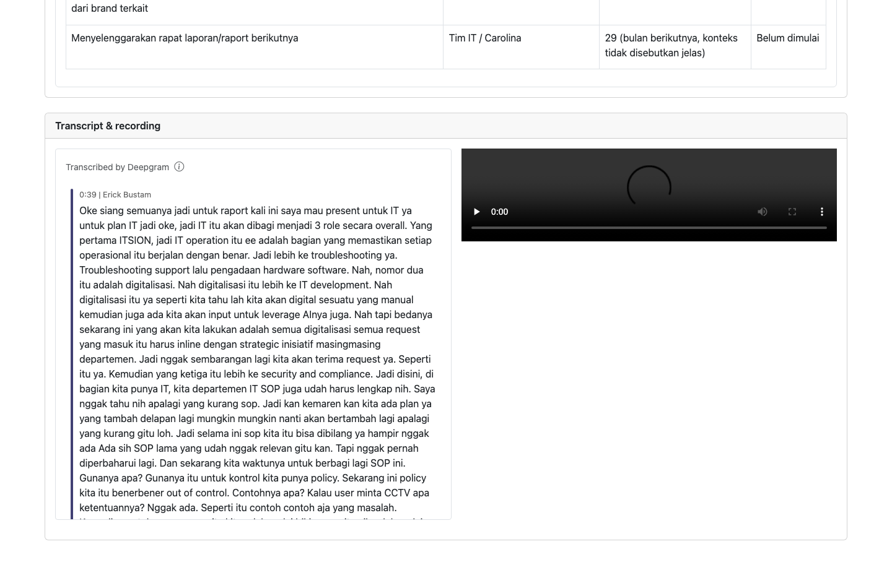

# Manual Guide Boga Meeting Assistant

Panduan ini menjelaskan cara membuat jadwal meeting dengan Boga Assistant tanpa perlu login. Pengguna cukup mengisi nama meeting, tanggal, jam, dan link meeting. Setelah itu, Boga Assistant akan masuk ke meeting sesuai jadwal dan menyediakan halaman hasil meeting.

## Ringkasan Fitur

Dengan Boga Meeting Assistant, pengguna dapat:

1. Membuat jadwal meeting tanpa akun.
2. Menjadwalkan Boga Assistant berdasarkan tanggal, jam mulai, dan jam selesai.
3. Melihat daftar meeting yang sudah dibuat.
4. Membuka halaman hasil meeting.
5. Melihat transcript dan video rekaman.
6. Mengedit catatan meeting atau MoM.
7. Mengunduh MoM dalam format Word atau PDF.

Catatan: Untuk saat ini, gunakan link Google Meet atau Microsoft Teams. Dukungan Zoom masih dalam proses.

## Akses Halaman

Buka link aplikasi Boga Assistant yang diberikan oleh tim. Dari halaman utama, pengguna akan diarahkan otomatis ke halaman pembuatan meeting.

Halaman ini tidak membutuhkan login.

## Membuat Meeting Baru

1. Buka halaman Boga Assistant.
2. Isi `Nama Meeting` dengan nama meeting yang mudah dikenali.
3. Pilih `Tanggal Meeting`.
4. Pilih `Jam Meeting`:
   - Kolom pertama adalah jam mulai.
   - Kolom kedua adalah jam selesai.
5. Isi `Link Meeting` dengan link Google Meet atau Microsoft Teams.
6. Klik `Submit`.
7. Periksa detail pada modal `Konfirmasi Meeting`.
8. Jika data sudah benar, klik `Buat Session`.

Jika berhasil, aplikasi akan menampilkan pesan sukses dan link `Buka halaman session`. Simpan link tersebut karena link ini dipakai untuk membuka hasil meeting.

## Perilaku Boga Assistant

Jika meeting dijadwalkan untuk waktu mendatang, Boga Assistant akan masuk otomatis pada jam yang dipilih.

Jika meeting dibuat untuk waktu yang sedang berjalan, Boga Assistant akan mencoba masuk segera.

Saat Boga Assistant masuk meeting, host mungkin perlu menerima bot dari waiting room.

## Daftar Meeting

Di bawah form, ada tabel daftar meeting. Kolom yang tersedia:

1. `Tanggal Meeting`: tanggal dan jam meeting.
2. `Nama Meeting`: nama yang diisi saat membuat session.
3. `Status`: kondisi meeting atau Boga Assistant.
4. `Session`: tombol `Open` untuk membuka halaman hasil meeting.
5. `Download`: tombol Word dan PDF untuk mengunduh MoM jika sudah tersedia.

Jika daftar meeting lebih dari satu halaman, gunakan tombol `Prev`, nomor halaman, dan `Next`.

## Membuka Halaman Session

Klik `Open` pada tabel meeting, atau klik `Buka halaman session` setelah membuat session baru.

Di halaman session, pengguna dapat:

1. Melihat status meeting.
2. Melihat transcript dan recording setelah tersedia.
3. Membuat ringkasan meeting.
4. Mengedit MoM di editor.
5. Menyimpan perubahan MoM.
6. Mengunduh MoM dalam format PDF atau DOCX.

Penting: siapa pun yang memiliki link halaman session dapat membuka hasil meeting dan mengedit MoM. Jangan bagikan link ke orang yang tidak berkepentingan.

Contoh tampilan halaman session saat MoM sudah tersedia:

## Edit MoM

MoM adalah catatan atau ringkasan hasil meeting. Untuk mengedit MoM:

1. Buka halaman session dari tombol `Open` atau link `Buka halaman session`.
2. Tunggu sampai panel `Meeting Summary` muncul.
3. Klik area isi MoM di bawah toolbar editor.
4. Ubah teks, heading, bullet, checklist, atau format lain sesuai kebutuhan.
5. Klik `Save` jika tombol muncul setelah ada perubahan.
6. Setelah tersimpan, klik `PDF` atau `DOCX` untuk mengunduh dokumen terbaru.

Jika MoM belum tersedia, klik `Generate Summary` terlebih dahulu. Jika MoM sudah ada dan perlu dibuat ulang, klik `Regenerate`.

## Lihat Transcript dan Video Session

Pada halaman session, scroll ke panel `Transcript & recording`.

Di panel ini, pengguna dapat:

1. Membaca transcript meeting di sisi kiri.
2. Melihat pembicara dan waktu percakapan pada transcript.
3. Memutar video recording di sisi kanan.
4. Menggunakan kontrol video untuk play, pause, volume, dan fullscreen.

Jika video belum muncul, kemungkinan rekaman masih diproses atau meeting belum selesai.

## Download Word dan PDF

Tombol Word dan PDF akan aktif jika MoM sudah tersedia. Jika tombol belum bisa diklik, biasanya penyebabnya:

1. Meeting belum selesai.
2. Transcript atau rekaman masih diproses.
3. MoM belum dibuat.
4. MoM belum berhasil disimpan.

Buka halaman session, buat atau simpan MoM terlebih dahulu, lalu gunakan tombol download.

## Batasan Penggunaan

Maksimal ada 3 meeting yang bisa berjalan di waktu bersamaan.

Jika sudah ada 3 meeting pada waktu yang sama, Boga Assistant tidak bisa dibuat untuk jadwal tersebut. Coba pilih jam lain atau tunggu sampai salah satu meeting selesai.

Pengguna yang login menggunakan batas akun masing-masing.

## Error Umum

`Session name is required.`

Nama meeting belum diisi. Isi `Nama Meeting`, lalu coba lagi.

`Meeting link is required.`

Link meeting belum diisi. Masukkan link Google Meet atau Microsoft Teams.

`Calendar time must be a valid date and time.`

Tanggal atau jam mulai tidak valid. Pilih ulang tanggal dan jam dari pilihan yang tersedia.

`Meeting end time must be after the meeting start time.`

Jam selesai harus lebih besar dari jam mulai.

`Boga Assistant cannot join right now because there are already 3 concurrent guest sessions.`

Jadwal sedang penuh. Pilih jam lain atau coba lagi setelah salah satu meeting selesai.

`Guest sessions are not configured yet because no project exists.`

Sistem belum siap digunakan. Hubungi tim support atau admin.

## Tips Penggunaan

1. Pastikan link meeting benar sebelum klik `Buat Session`.
2. Buat jadwal beberapa menit sebelum meeting dimulai agar host sempat menerima Boga Assistant.
3. Jangan menutup link halaman session jika masih ingin membuka hasil meeting.
4. Jangan membagikan link session ke orang yang tidak berkepentingan.
5. Setelah meeting selesai, tunggu beberapa saat sampai transcript, video, dan MoM selesai diproses.
